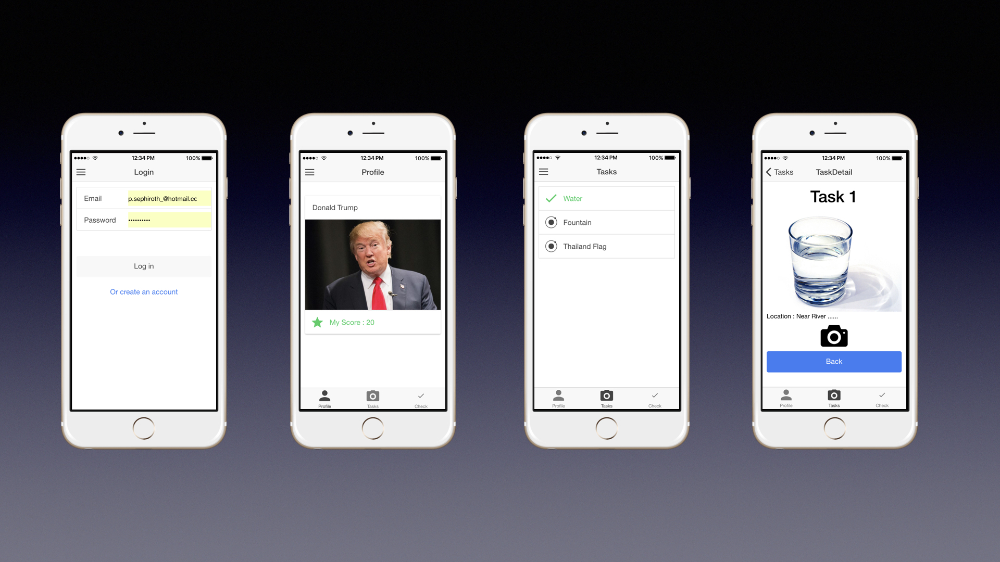
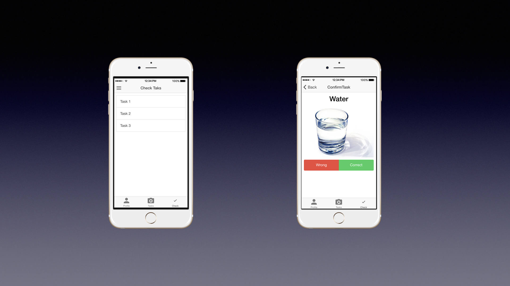

## Scavenger Hunt
This project is a part of Hybrid mobile application developement CS4404

## Description

Scavenger Hunt is a game that user need to hunt the object or a thing that provide by creator or host. User can collect the score by take a photo and upload it. After that admin will check that photo correct or not if correct user will get score that they can challenge with other user.

## Project Prototype





[Link IONIC Prototype](https://creator.ionic.io/share/2cee2e895975).


## Contributors
- Vorapat P. 5612690
- Chawan  V. 5737444


## How to run project

```bash
$ git clone https://github.com/VorapatPP/Scavengerhunt
$ cd scavanger
$ npm install
$ ionic serve
```

IOS Version

```bash
$ ionic cordova platform add ios
$ ionic cordova run ios
```

Android version

```bash
$ ionic cordova platform add android
$ ionic cordova run android
```
## Next feature will be release
- Login system
- Upload photo or take a photo
- Checking task
- Calculate score

## Issues and bugs


